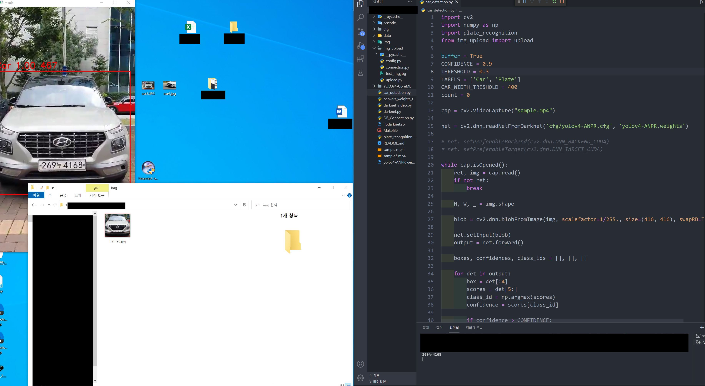

# License plate recognition and detection.


## Basic Overview

This repository is a solution that recognizes and detects license plates.

---

## Getting Start

- Clone Plate-recognizer to your hard drive with `https://github.com/S-jooyoung/Plate-recognizer.git`
- Download the pretrained model from:
- install tesseractOCR:
  `https://github.com/tesseract-ocr/tesseract`
- Put a license plate video that you want to detect.

```python
#car_detection.py

cap = cv2.VideoCapture("sample.mp4")

net = cv2.dnn.readNetFromDarknet('cfg/yolov4-ANPR.cfg', 'yolov4-ANPR.weights')
```

- run `python car_detection.py`

---

## Example



---

## Learn

- If you want to know the license plate recognition principle, refer to it `main.ipynb`

---

## Contributing

Let's connect 👨‍💻 and forge the future together.😁✌

**Check the Repositories and don't forget to give a star.** 👇

:star: From [S-jooyoung](https://github.com/S-jooyoung)
